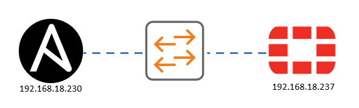
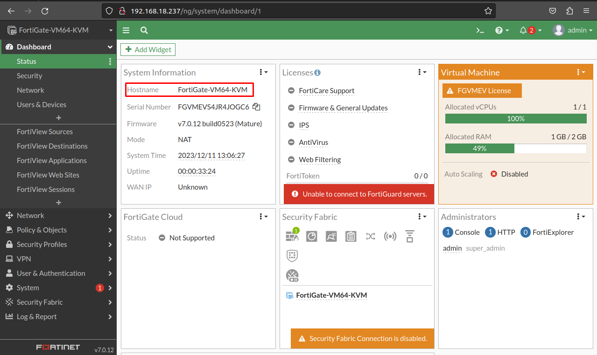
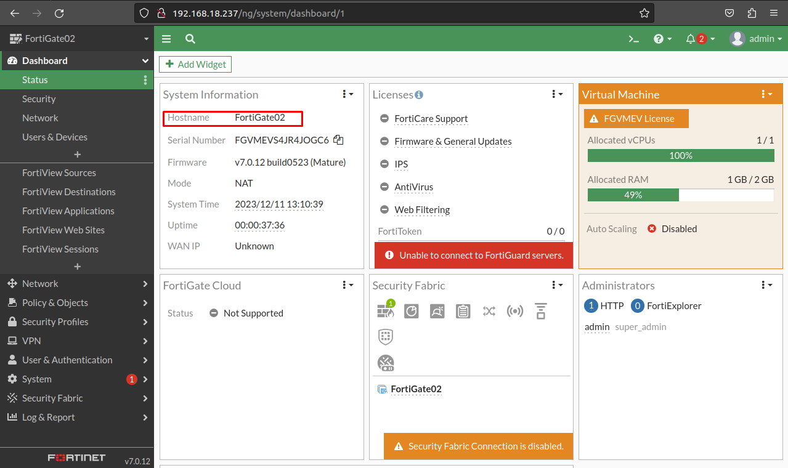
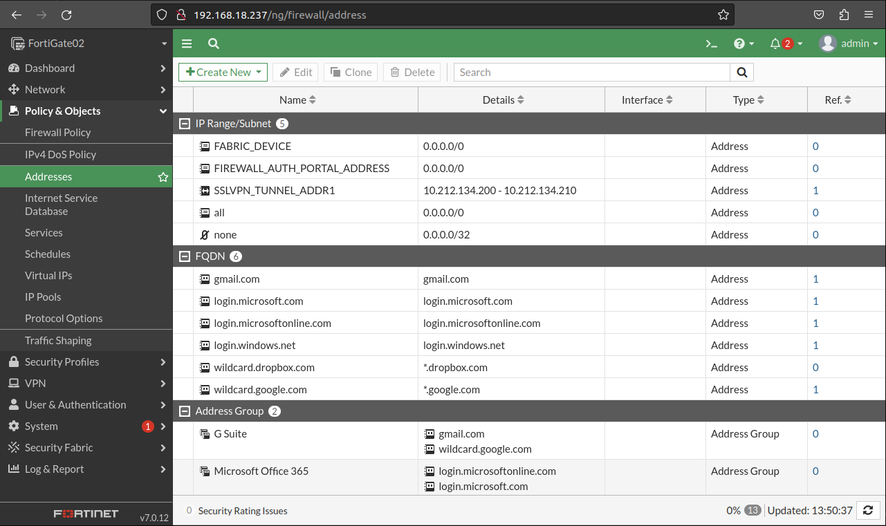
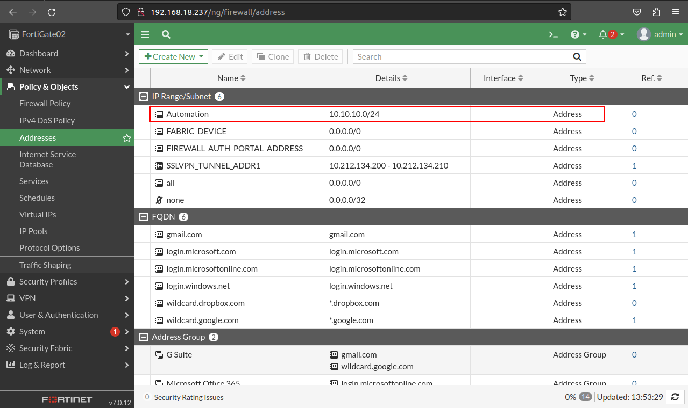
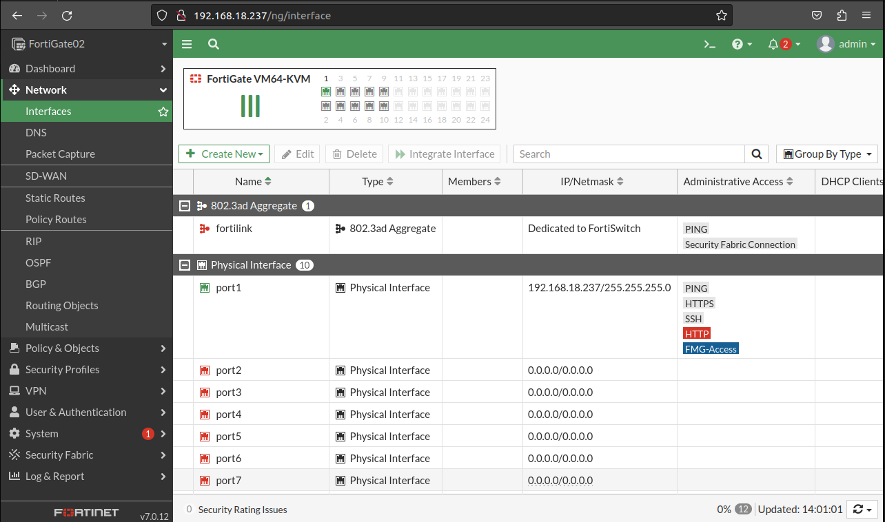
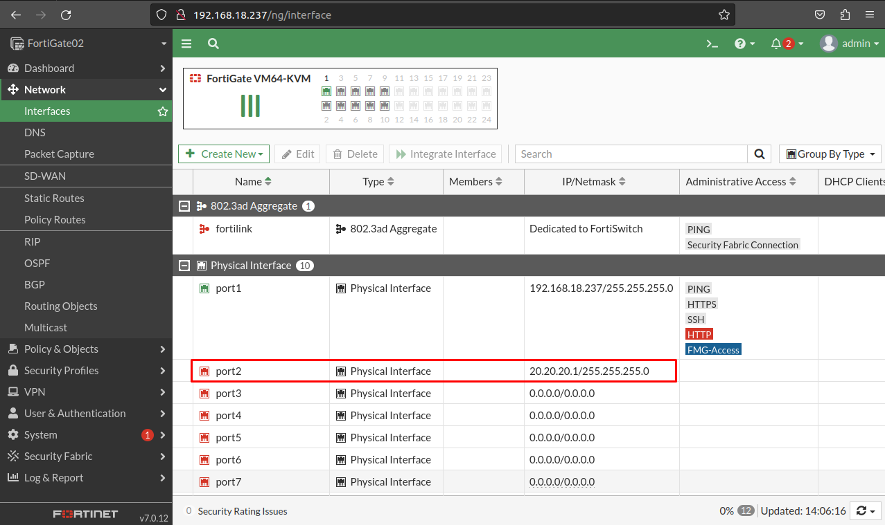
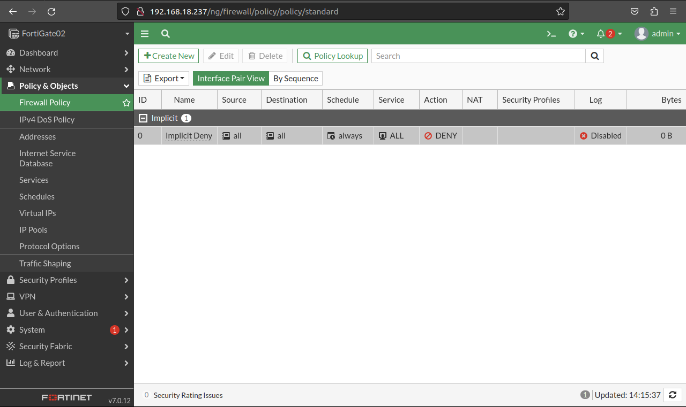
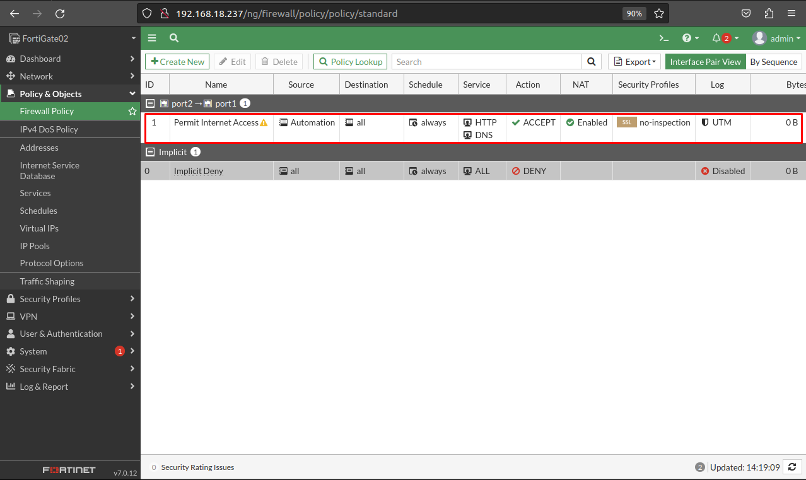

## FORTIGATE AUTOMATION WITH ANSIBLE

## 1. Install FortiOS module  collection from Ansible Galaxy
```go
ansible-galaxy collection install fortinet.fortios
```
## 2. Example 01
**Inventory**
```go
[fortigates]
fortigate01 ansible_host=192.168.18.237 ansible_user="admin" ansible_password="admin"

[fortigates:vars]
ansible_network_os=fortinet.fortios.fortios
```
**Playbook**
```go
---
- hosts: fortigates
  collections:
   - fortinet.fortios
  connection: httpapi
  vars:
   vdom: "root"
   ansible_httpapi_use_ssl: no
   ansible_httpapi_validate_certs: no
   ansible_httpapi_port: 80
  tasks:
  - name: Configure global attributes.
    fortios_system_global:
      vdom:  "{{ vdom }}"
      system_global:
        hostname: "FortiGate02"
```
- Antes:

- Después:

## 3. Example 02
**Inventory**
```go
[fortigates]
fortigate01 ansible_host=192.168.18.237 ansible_user="admin" ansible_password="admin"

[fortigates:vars]
ansible_network_os=fortinet.fortios.fortios
```
**Playbook**
```go
---
- hosts: fortigates
  collections:
   - fortinet.fortios
  connection: httpapi
  vars:
   vdom: "root"
   ansible_httpapi_use_ssl: no
   ansible_httpapi_validate_certs: no
   ansible_httpapi_port: 80
  tasks:
  - name: Create address
    fortios_firewall_address:
      state: present
      firewall_address:
        name: "Automation"
        subnet: "10.10.10.0/24"
```
- Antes:

- Después:

## 4. Example 03
**Inventory**
```go
[fortigates]
fortigate01 ansible_host=192.168.18.237 ansible_user="admin" ansible_password="admin"

[fortigates:vars]
ansible_network_os=fortinet.fortios.fortios
```
**Playbook**
```go
---
- hosts: fortigates
  collections:
   - fortinet.fortios
  connection: httpapi
  vars:
   vdom: "root"
   ansible_httpapi_use_ssl: no
   ansible_httpapi_validate_certs: no
   ansible_httpapi_port: 80
  tasks:
  - name: Create Port2 Address
    fortios_system_interface:
      state: present
      system_interface:
        name: "port2"
        ip: 20.20.20.1/24
        status: "up"
```
- Antes:

- Después:

## 5. Example 04
**Inventory**
```go
[fortigates]
fortigate01 ansible_host=192.168.18.237 ansible_user="admin" ansible_password="admin"

[fortigates:vars]
ansible_network_os=fortinet.fortios.fortios
```
**Playbook**
```go
---
- hosts: fortigates
  collections:
   - fortinet.fortios
  connection: httpapi
  vars:
   vdom: "root"
   ansible_httpapi_use_ssl: no
   ansible_httpapi_validate_certs: no
   ansible_httpapi_port: 80
  tasks:
  - name: Create Firewall Policy Allowing Internet Access
    fortios_firewall_policy:
      state: present
      firewall_policy:
        policyid: 1
        name: "Permit Internet Access"
        srcintf:
          - name: "port2"
        dstintf:
          - name: "port1"
        action: "accept"
        srcaddr:
          - name: "Automation"
        dstaddr:
          - name: "all"
        schedule: "always"
        service:
          - name: "HTTP"
          - name: "HTTP"
          - name: "DNS"
        nat: "enable"
```
- Antes:

- Después:

## Referencias
- [https://galaxy.ansible.com/ui/repo/published/fortinet/fortios/](https://galaxy.ansible.com/ui/repo/published/fortinet/fortios/)
- [https://www.youtube.com/watch?v=RzUlruC2CA4](https://www.youtube.com/watch?v=RzUlruC2CA4)
